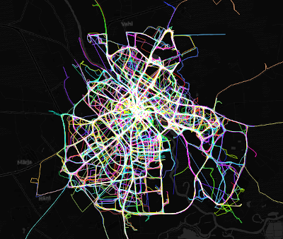

## PhD research topic and objective
The topic of the PhD research is "Assessing the Spatiotemporal Variability in Environmental Exposure". The objective of the research in 4 year period is to reach a better understanding of the associations between urban mobility and environmental exposure via developing methodology of assessing dynamic exposure to urban greenspaces and air and noise pollution. 

## Vizualization
The data vizualiations will be produced via open-source software. However, it must be done in a way that particular individuals cannot be identified from the visualiation. On the other hand, if presenting the whole dataset, it is a challenge to do it in understandable way.
Below, an example on Tartu bicycle sharing system is presented. These are bike rides taking place in July, 2019. This data is available publicly. Each color indicates a separate ride. However, it is not possible to distinguish a separate route. The burnout effect is used to illustrate the busiest streets.

Regarding the vizualiation of air pollution and noise level data, traditionally a grid is used and the data is aggregated into each grid cell (see the example below). However, in nature air pollution levels do not change sharply. This is not just a question about vizualization, but also about the precision of the results, as air/noise pollution values are correlated with human mobility. 

## Reproducibility
### Analysis
To develop the methodology of assessing dynamic exposure to urban greenspaces, air pollution, and noise, geocomputational (share of land use per area unit; functional density; aggregation of exposure, based on time; temporal differences, etc.) and statistical methods will be exploited. 
Geocomputational analysis will be conducted in PostgreSQL and QGIS. Statistical analysis will be performed in RStudio. All of the software used for the analysis is open-source. The code used for the analysis will be available in a public repository and thus can be accessed and modified if necessary. 

### Data 
Long-term pseudonymized GPS dataset will be analyzed in relation to land use and other environment characteristics. Fine scale (grid cell 25 m x 25 m) modeled air pollution and noise level data will be provided by the Institute of Family Medicine and Public Health. Land cover data will be retrieved from the Estonian Topographic Database and OpenStreetMap. 

#### GPS dataset 
Long-term pseudonymized GPS dataset is being collected and maintained by the Mobility Lab, Department of Geography, University of Tartu. The GPS dataset is complemented with semantic information about the regularly visited places declared by respondents and their socio-economic characteristics. 
The access to data is restricted. It is not publicly available, as it contains personal data. However, the methodology is applicable to other GPS datasets (also synthetic ones).

#### Estonian Topographic Database
Estonian Topographic Database (ETD), created and maintained by the Estonian Land Board, is available for download in vector data format: (https://geoportaal.maaamet.ee/est/Andmed-ja-kaardid/Topograafilised-andmed/Eesti-topograafia-andmekogu-p79.html). It consists of several layers with subclasses (https://geoportaal.maaamet.ee/index.php?lang_id=1&page_id=519). According to the Land Board, it is updated weekly. 
The data can be used freely and free of charge under the terms of the Licence of open data by Estonian Land Board, 1.07.2018. The licensee can use the data, as well as to produce derivatives of data, adapt and combine data with other data, products or services, use the data for commercial or non-commercial purposes, and redistribute data with a reference to the origin of data. 
To ensure that the data used for the analysis is available afterwards, it will be downloaded and stored in a public repository together with its metadata, referenced in the articles.

#### Open Street Map
Open Street Map (OSM) is a project aiming to produce geographical data that can be used freely and free of charge under the Open Data Commons Open Database License (https://www.openstreetmap.org/copyright). In Estonia, a non-profit organization MTÜ Avatud Maakaardi Selts (Open Landmap Society) is the local chapter. As on of the inputs for the vector data, ETD is used, however, it is modified to comply with OSM data elsewhere. OSM data for Estonia can be downloaded from GEOFABRIK DE (https://download.geofabrik.de/europe/estonia.html). However, it does not contain metadata on the modification time. Furthermore, historical versions of data are not available. Therefore, it will also be stored in a public repository with metadata on its retrieval time.

#### Air pollution and noise pollution levels
The data on air pollution and noise pollution will be provided by the Institute of Family Medicine and Public Health. This data is produced on the basis of public air quality monitoring stations (https://seire.keskkonnainfo.ee/) and the measurements of the Institute. The final data is not available publicly. 

## Science Communication
In order to communicate the results of the study, scientific articles will be published in field-related journals and popular science articles will be prepared to communicate the findings to general public. Also, it must be considered to present the studies to different stakeholders, such as local municipalities or urban planners.